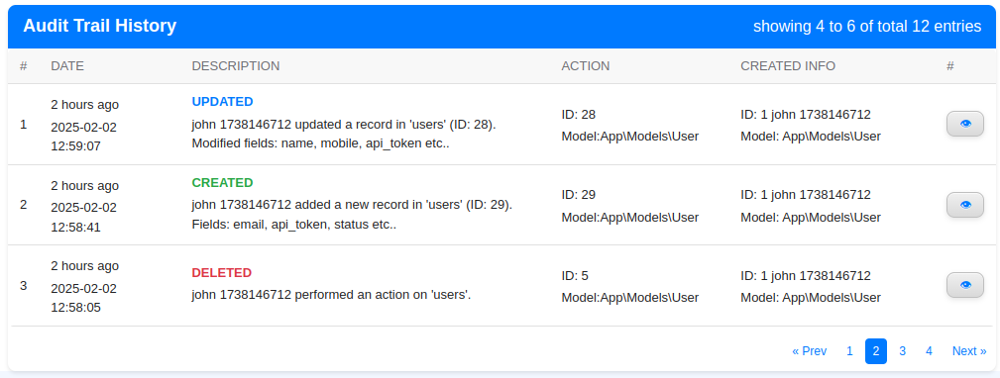

# AuditTrail a Laravel package for managing audit logs

[](https://packagist.org/packages/souravmsh/audit-trail)
[](https://github.com/souravmsh/audit-trail/actions?query=workflow%3Arun-tests+branch%3Amain)
[](https://github.com/souravmsh/audit-trail/actions?query=workflow%3A"Fix+PHP+code+style+issues"+branch%3Amain)
[](https://packagist.org/packages/souravmsh/audit-trail)
[](https://github.com/souravmsh/audit-trail/blob/master/LICENSE.MD)

---
<b>Audit Trail</b> is a Laravel package that provides an easy-to-use mechanism for maintaining table row audit logs. It automatically tracks changes to database records, including created, updated, and deleted events, making it easier to monitor data modifications and user activities.



## Installation
#### 1. You can install the package via Composer:

```bash
composer require souravmsh/audit-trail
```

#### 2. Alternatively, you can install it manually:
Create directories:
```bash
mkdir -p packages/souravmsh
cd packages/souravmsh
```
Clone git repository:
```bash
git clone https://github.com/souravmsh/audit-trail.git
```
Add below lines to laravel/composer.json file:
```bash
"repositories": [
    {
        "type": "path",
        "url": "./packages/souravmsh/audit-trail",
        "options": {
            "symlink": true
        }
    }
]
```
Then,
```bash
composer require souravmsh/audit-trail:dev-main

```
#### 3. Publish and Run Migrations

To publish and run the migrations, use:

```bash
php artisan audit-trail:install
```
This will create the necessary database tables for logging audit records.

## Usage


### 1. Enable Audit Logging in .env (default true)
`AUDITTRAIL_ENABLED=true/false`


### 2. Using AuditTrail Trait in a Model to Enable Audit Logging
To enable auditing in a model, open your model file (e.g., User.php) and add the AuditTrail trait.

```php
<?php

use Souravmsh\AuditTrail\Traits\AuditTrail;

class User extends Authenticatable
{
    use AuditTrail;

    /**
     * Define attributes to be ignored in auditing.
     * This will merge with the default ignored attributes in `config/audit-trail.php`.
     * If you don't need to ignore any attributes, you can omit this property.
     */
    public $auditTrailIgnoreAttributes = ['email'];
    
    /**
     * Define specific attributes to track.
     * If this is left blank, all attributes will be tracked except the ignored ones.
     */
    public $auditTrailAllowedAttributes = ['name', 'email', 'about'];
}
```

### 3. Configure AuditTrail (Optional)
Modify the `config/audit-trail.php` file to enable or disable logging and configure ignored attributes.

```php
return [
    /*
     * Enable or disable activity logging.
     * You can manage it using the `.env` file with `AUDITTRAIL_ENABLED=true/false`.
     */
    'enabled' => env('AUDITTRAIL_ENABLED', true),

    /*
     * Configuration for the audit trail table.
     */
    'migration' => [
        'table' => 'audit_trails',  // The name of the table that stores the activity logs
        'pagination' => 10,  // Number of activities to display per page
    ],

    /*
     * Default attributes to be ignored during activity logging.
     * This prevents logging of sensitive fields.
     */
    'ignored_attributes' => [
        '_token', 'remember_token', 'password', 'created_at', 'updated_at', 'deleted_at',
    ],
];
```

#### 4. Logging Audit Data

You can manually log audit records using the <b>AuditTrail</b> facade:

Log an audit trail entry using the AuditTrail package.

This example demonstrates how to log changes made to a specific model.
The audit log captures details such as the type of action performed, 
the model being updated, the changed data, and the user responsible.

Parameters:
- type: The action type (CREATED, UPDATED, DELETED, LOGGEDIN, IMPORTED, EXPORTED, OTHER).
- message: (Optional) message.
- model_type: The fully qualified class name of the model being logged.
- model_id: The specific model instance ID associated with the change.
- data: An array containing changes, specifying old and new values.

```php
use Souravmsh\AuditTrail\Facades\AuditTrail;
        
// Supports both array-based calls
AuditTrail::log([
    "type"       => "CREATED",
    "message"    => "A recond has created",
    "model_type" => "App\Models\User",
    "model_id"   => 1,
    "data"       => ["title" => ["old" => "John", "new" => "Alex"]],
]);

// Handles loggedin without a model
AuditTrail::log([
    "type"    => config('audit-trail.migration.type.loggedin'),
    "message" => "A user login in 1."
]);

// or
AuditTrail::log("LOGGEDIN", "A user logged in 2.");
```

#### 5. Access model directly
```bash
use Souravmsh\AuditTrail\Models\AuditTrail;

$audit = AuditTrail::find(1);

```

#### 6. Retrieving Audit History
To fetch the audit log for a specific model:

```php
use Souravmsh\AuditTrail\Facades\AuditTrail;

$auditLogs = AuditTrail::history([
    "per_page"     => "10",
    "limit"        => "100",
    "model_type"   => "App\Models\User",
    "model_id"     => "1",
    "creator_type" => "",
    "creator_id"   => "",
    "show_model"   => "false",
    "show_creator" => "true"
]);
```

#### 7. Blade Component for Displaying Audit Logs:-
You can use the built-in Blade component widget to display audit logs in your UI:

Blade Component for Displaying Audit Logs

This component is used to display audit trail logs in the UI.
You can configure various parameters to filter and control the displayed logs.

Parameters:
- title: The title of the audit trail widget.
- per_page: Number of records displayed per page.
- limit: Maximum number of audit logs to fetch.
- model_type: The target model type for which logs are fetched.
- model_id: The specific model instance ID to filter logs.
- creator_type: The type of creator who performed the action (e.g., User, Admin).
- creator_id: The specific creator ID to filter logs.
- show_model: Set to "true" to load data with the 'model' relation, which links to the target table.
- show_creator: Set to "true" to load data with the 'creator' relation, which links to the user who performed the action.

```html
<x-audit-trail-widget 
    title="Audit Trail History"
    per_page="10"
    limit="100"
    model_type="App\\Models\\User"
    model_id="1"
    creator_type=""
    creator_id=""
    show_model="false" 
    show_creator="true" 
/>
```
also, you can pass request query parameters:
```html

<x-audit-trail-widget 
    title="{{ request('title') }}"
    per_page="{{ request('per_page') ?? 10 }}"
    type="{{ request('type') }}"
    model_type="{{ request('model_type') }}"
    model_id="{{ request('model_id') }}"
    creator_type="{{ request('creator_type') }}"
    creator_id="{{ request('creator_id') }}"
    date_from="{{ request('date_from') }}"
    date_to="{{ request('date_to') }}"
    show_model="false" 
    show_creator="false" 
/>
```

#### 8. Adding Custom Styles
To ensure the audit trail widget looks great, include the custom CSS file in your Blade template. Add the following `<link>` tag to the `<head>` section of your template:

```html
<link href="{{ asset('vendor/audit-trail/stylesheet.css') }}" rel="stylesheet">
```

## Testing
Run tests using:

```bash
composer test
```

## Changelog

Please see [CHANGELOG](CHANGELOG.md) for more information on what has changed recently.


## License

The MIT License (MIT). Please see [License File](LICENSE.md) for more information.
